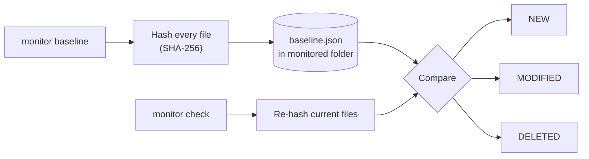

<p align="center">
  
</p>

<h1 align="center">SentinelBlade</h1>

<p align="center"><b>Forge your defense.</b><br/>
A zero-dependency defensive toolkit for file verification, integrity monitoring, authorized port checks and password-strength feedback.</p>

<p align="center">
  
  
  
  
</p>

<p align="center">
  <a href="#overview">Overview</a> ·
  <a href="#features">Features</a> ·
  <a href="#installation">Installation</a> ·
  <a href="#usage">Usage</a> ·
  <a href="#how-integrity-monitoring-works">How it works</a> ·
  <a href="#security-and-privacy-design">Security design</a> ·
  <a href="#ethical-use">Ethical use</a>
</p>

---

## Overview

SentinelBlade bundles four everyday defensive tasks into one small command-line tool:

| Module | Command | Purpose |
|--------|---------|---------|
| **Hash** | `hash` | Compute file digests and verify them against an expected value |
| **Monitor** | `monitor` | Build a baseline of a folder and detect changes against it |
| **Ports** | `ports` | Run concurrent, authorization-guarded TCP port checks |
| **Passcheck** | `passcheck` | Analyze password strength with hidden input |

A fifth command, `report`, converts any saved JSON result into another timestamped report.

It is written for **Python 3.10+** and uses **only the standard library at runtime**. There is nothing to install beyond Python, which keeps the tool easy to audit and easy to run on locked-down machines.

## Features

### File verification
- **SHA-256** (default), **SHA-512** and **MD5** digests
- Optional `--verify` to compare against an expected digest

### Integrity monitoring
- SHA-256 **baselines** of a folder
- Detects **NEW**, **MODIFIED** and **DELETED** files on every check

### Authorized port checking
- **Concurrent** TCP checks with a configurable timeout
- Common **service name** labels
- **Authorization guard** for any non-local target

### Password analysis
- **Hidden-input** prompt: the password is never printed or written to output
- Built-in **common-password list** check
- **Entropy estimate**, **score** and **improvement tips**

### Reporting
- Timestamped **JSON** and **TXT** exports from any command
- Convert saved JSON results into other formats with `report`
- **Cross-platform terminal colors** with a plain-text fallback

## Installation

Requires Python 3.10 or newer. No runtime dependencies.

Run directly from the repository:

```bash
python -m sentinelblade --help
```

Or install the `sentinelblade` console command in editable mode:

```bash
python -m pip install -e .
sentinelblade --help
```

## Usage

### Hash and verify files

```bash
# SHA-256 is the default
python -m sentinelblade hash myfile.txt

# Choose an algorithm and verify an expected digest
python -m sentinelblade hash myfile.txt --algorithm sha512 --verify EXPECTED_DIGEST
```

### Monitor file integrity

```bash
# 1. Record a known-good baseline (baseline.json is stored in the monitored folder)
python -m sentinelblade monitor baseline ./myfolder

# 2. Later, compare the folder against that baseline
python -m sentinelblade monitor check ./myfolder
```

### Check TCP ports

```bash
# Localhost; ranges are inclusive
python -m sentinelblade ports 127.0.0.1 --range 1-1024

# Non-local targets require an explicit authorization acknowledgment
python -m sentinelblade ports 192.0.2.10 --range 80-443 --authorized
```

### Check password strength

```bash
# Enter the password at a hidden prompt; it is not printed or included in output
python -m sentinelblade passcheck
```

### Export and convert reports

```bash
# Export the result of any command as timestamped JSON or TXT
python -m sentinelblade hash myfile.txt --output report.json
python -m sentinelblade monitor check ./myfolder --output integrity.txt
python -m sentinelblade ports 127.0.0.1 --range 1-128 --output ports.json
python -m sentinelblade passcheck --output password.txt

# Convert a saved JSON result into another timestamped report
python -m sentinelblade report --input report.json --output report.txt
```

### Version

```bash
python -m sentinelblade --version
```

## How integrity monitoring works



1. `monitor baseline` records the SHA-256 digest of each file and saves it as `baseline.json` in the monitored folder.
2. `monitor check` hashes the folder again and compares the result against that baseline.
3. Each difference is reported as **NEW** (not in the baseline), **MODIFIED** (digest changed) or **DELETED** (in the baseline but missing now).

Create the baseline while the system is in a known-good state. Anything that changes afterwards will show up in the next check.

## Security and privacy design

- **Passwords stay private.** `passcheck` reads input from a hidden prompt, and the password is never printed or included in any output or export.
- **Authorization guard.** Ports on non-local targets can only be checked when you pass `--authorized`.
- **Honest limits.** The `--authorized` flag records your acknowledgment. It cannot verify ownership or permission for you, so the responsibility stays with the operator.
- **Warning on every port check.** The tool prints: *"Only scan systems you own or have written permission to test."*
- **Small attack surface.** No third-party runtime dependencies to audit or keep patched.
- **Timeouts.** Port checks use a timeout so a check cannot hang indefinitely.

## Ethical Use

Use SentinelBlade only on systems and files you own or are explicitly authorized to assess. Port scanning without permission may violate laws, policies or service terms. The user is responsible for obtaining authorization and complying with applicable requirements. SentinelBlade is provided for defensive and educational use.

## Author

**Ahmed Tarek Salah**, Cybersecurity Researcher, building at [PYRAMID-SEC](https://github.com/PYRAMID-SEC).

[](https://www.linkedin.com/in/ahmed-t-756505379/)
[](https://hackerone.com/thaqib)
[](https://github.com/PYRAMID-SEC)
## License

SentinelBlade is distributed under the MIT License. See [LICENSE](LICENSE).
